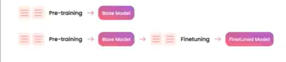
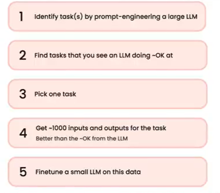
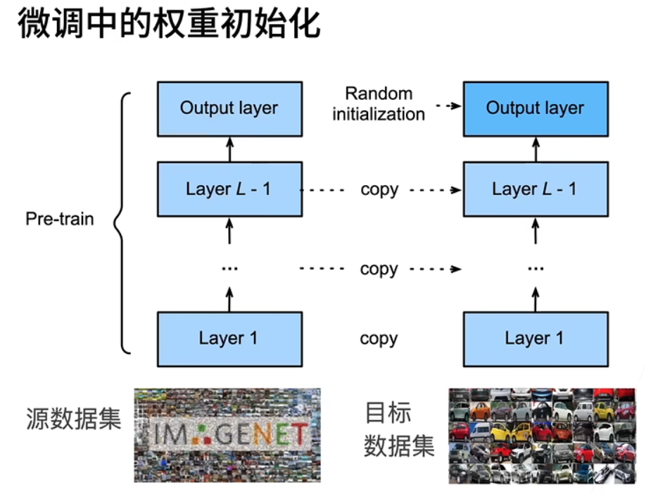

# 微调

一开始我以为微调就是改改学习率、epoch、step什么的，目的是降低loss。

但实际上，微调涉及：

- 新的更specific的数据集、
- 微调的方法（lora、p-tunning等），这影响到模型神经网络的每一层如何变化、
- 参数冻结等。
- 所以不是只变参数。

目的是让模型响应更一致，更好的预测我们要的结果。

## 预训练模型

LLM模型，都是要预测下一个token。

预训练模型的数据集，更大，更普适性，一般不公开。所以我们不知道预训练模型的训练过程。

有的时候特定领域并没有太多数据和算力，在通用领域数据上预训练过的大模型，经过在特定领域特定任务上微调，可以比较省算力和数据。

## 微调模型

微调是在预训练之后：

微调其实是“更多的训练”，特点是：

- 需要新的**“自有”数据集**；
- 更少数据的数据集；
- 有标签、无标签数据均可；
- 与预训练的目标相同，都是进行下一个token预测，我们所做的只是改变数据，使其更有结构性，让模型在输出和模仿这种结构时更加一致；
- 减少模型更新：冻结一部分模型参数、冻结神经网络的一部分层（底层）。
- 更多见下面”微调思路“部分

**微调的优点：**

1. 行为改变

- 模型响应更一致
- 模型更好地集中注意力
- 模型更智能

2. 获得知识

- 增加对新的特点主题的知识
- 纠正旧的知识

## 微调的任务

1. 确定任务
2. 找到适配的预训练模型
3. 选一个最合适的模型
4. 准备好自己的数据集
5. 在自己的数据集上微调预训练模型

## 指令微调

待补充……

## 微调背后的原理

一个神经网络（分类）一般可以分成两块：

- 特征抽取：将原始像素变成容易做线性分割的特征
- 线性分类器：做分类

**微调：**

目标数据集改变了（自己的数据集），那么原本的模型，**特征抽取部分可以复用**，但是最后分类器部分不能复用（标号变了）。

复用的特征抽取部分，可以做一些参数的调整，让结果更好，就是微调。

**微调思路：**

训练：

 - 使用更小的学习率
 - 使用更少的数据迭代
 - 源数据集远复杂于目标数据（数量、样本个数远大于，这样微调效果才好）

重用分类器权重：

- 源数据集包含目标数据集的部分标号
- 可以用预训练好的模型分类器中，对呀标号对应的向量来做初始化

固定一些层：

- 神经网络的学习有层次
  - **低层次特征更加通用（更抽象）**
  - 高层次的特征和数据集更相关（更具体，和标号强相关）
- 可以**固定底部**一些层的参数，不参与更新，模型复杂度变低，更强的正则

## 微调有这些方法：

大模型微调方法总结的论文“Scaling Down to Scale Up: A Guide to Parameter-Efficient Fine-Tuning“。

## 总结：

- 微调通过使用在大数据上得到的预训练好的模型，来初始化模型权重，来完成提升精度

- 预训练模型质量很重要

- 微调通常速度更快、精度更高

