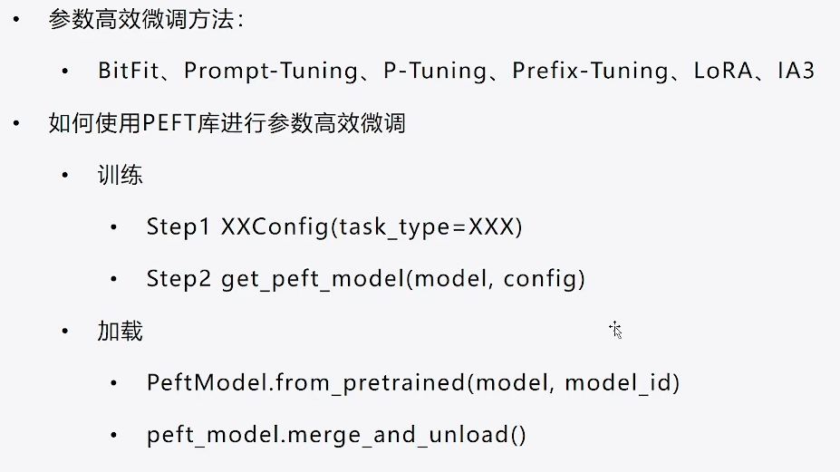

# 微调方法总结

具体各方法原理见各代码文件。




## 查看模型参数大小

```python
sum(param.numel() for param in model.parameters())
# 或者
model.parameters
```


## 流程

1. 创建模型model： AutoModelFor**.from_pretrained()
2. 创建TuningConfig：PromptTuningConfig
3. 创建PeftModel：model = get_peft_model(model, config)
4. 配置训练参数：TrainingArguments
5. 创建训训练器：Trainer(model = model, args = args)
6. 模型训练：trainer.train()
7. 模型加载


## 1 BitFit

参数微调核心：冻结模型的非bias部分，只选择模型参数里面的所有bias部分。

在全连接部分，WX+B，B就是bias部分。


代码逻辑就是，在训练前，**冻结部分参数（requires_grad = False）**

```python
for name, param in model.named_parameters():
    if "bias" not in name:
        param.requires_grad = False
    else:
        num_param += param.numel()
```


## 2 Prompt-Tuning

```python
from peft import PromptTuningConfig, get_peft_model, TaskType, PromptTuningInit

# 1：创建PromptTuningConfig，有soft和hard两种
# Soft Prompt
config = PromptTuningConfig(task_type=TaskType.CAUSAL_LM, num_virtual_tokens=10)
#  Overview of the supported task types:
    # - SEQ_CLS: Text classification.
    # - SEQ_2_SEQ_LM: Sequence-to-sequence language modeling.
    # - CAUSAL_LM: Causal language modeling.
    # - TOKEN_CLS: Token classification.
    # - QUESTION_ANS: Question answering.

# Hard Prompt
config = PromptTuningConfig(task_type=TaskType.CAUSAL_LM,
                            prompt_tuning_init=PromptTuningInit.TEXT,
                            prompt_tuning_init_text="下面是一段人与机器人的对话。",
                            num_virtual_tokens=len(tokenizer("下面是一段人与机器人的对话。")["input_ids"]),
                            tokenizer_name_or_path="Langboat/bloom-389m-zh")

# 2：创建peft模型
model = get_peft_model(model, config) # 这就是一个PEFT的model了，PeftModelForCausalLM，

model.print_trainable_parameters() # 可训练参数

# 3：TrainingArguments、Trainer

# 4：trainer.train()

# 5：加载训练好的PEFT模型
from peft import PeftModel
# 要重新加载预训练模型
model = AutoModelForCausalLM.from_pretrained("Langboat/bloom-389m-zh", low_cpu_mem_usage=True)
# 基于这个model加载peft参数
peft_model = PeftModel.from_pretrained(model=model, model_id="./chatbot/checkpoint-200/")

# 6： 使用peft模型
peft_model = peft_model.cuda()
ipt = tokenizer("Human: {}\n{}".format("考试有哪些技巧？", "").strip() + "\n\nAssistant: ", return_tensors="pt").to(peft_model.device)
print(tokenizer.decode(peft_model.generate(**ipt, max_length=128, do_sample=True)[0], skip_special_tokens=True))
```


## 3 P-tuning

```python
from peft import PromptEncoderConfig, TaskType, get_peft_model

config = PromptEncoderConfig(task_type=TaskType.CAUSAL_LM, 
                             num_virtual_tokens=10,
                             encoder_reparameterization_type=PromptEncoderReparameterizationType.MLP,  # 要使用的重新参数化类型
                             encoder_dropout=0.1, 
                             encoder_num_layers=5, encoder_hidden_size=1024)

model = get_peft_model(model, config)

trainer = Trainer(model=model)

```


## 4 Prefix-Tuning

```python
from peft import PrefixTuningConfig, get_peft_model, TaskType

# prefix_projection=True:要不要有全连接层
config = PrefixTuningConfig(task_type=TaskType.CAUSAL_LM, num_virtual_tokens=10, prefix_projection=True)

model = get_peft_model(model, config)
```


## 5 Lora

```python
from peft import LoraConfig, TaskType, get_peft_model

config = LoraConfig(task_type=TaskType.CAUSAL_LM, 
                    target_modules=".*\.1.*query_key_value",  # 正则匹配，只有*.1.*开头的query_key_value会加上lora头
                    modules_to_save=["word_embeddings"]) # 除了lora之外，还要训练哪一部分的参数

model = get_peft_model(model, config)

model
# (base_model): LoraModel
# (base_layer): Linear(in_features=1024, out_features=3072, bias=True)
# (lora_A): ModuleDict(
#                   (default): Linear(in_features=1024, out_features=8, bias=False)
#                 )
# (lora_B): ModuleDict(
#                   (default): Linear(in_features=8, out_features=3072, bias=False)
#                 )
# (lora_embedding_A): ParameterDict()
# (lora_embedding_B): ParameterDict()
                    
```

